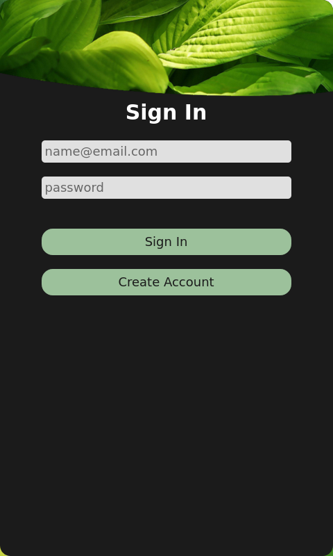
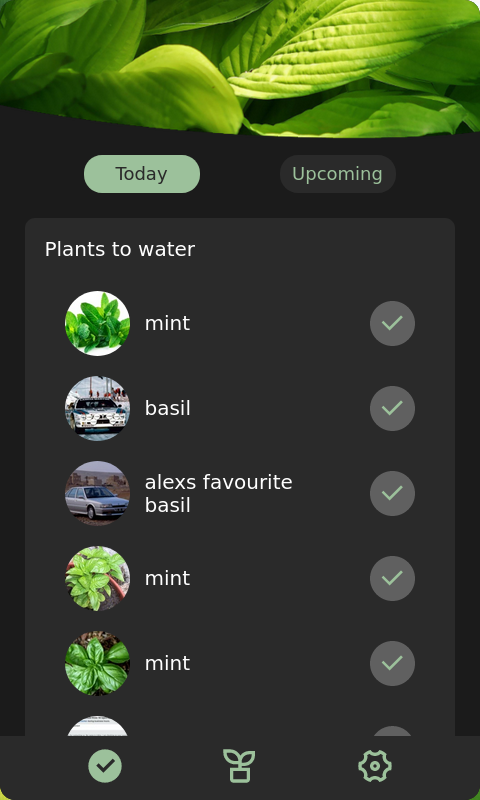
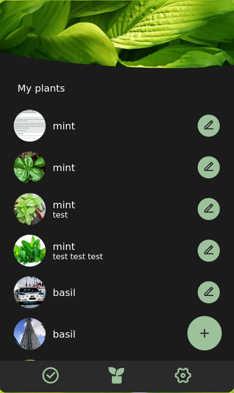
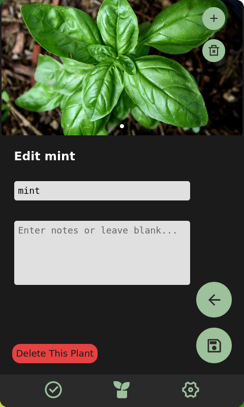

# Bloomint (Frontend)

<h1>
  <a href="https://bloomint.xyz" target="_blank" style="font-size: 36px;">Live Demo</a>
</h1>

With the increase of time spent at home during the pandemic, many people have turned to houseplants to greenify their living spaces. Bloomint aims to assist new plant owners by providing an easy way to catalogue houseplants, find care instructions, and receive reminders of when to water or fertilize their plants. Project is currently at MVP stage, future planned releases include handling image upload, push notifications to mobile devices for watering, and search functionality for plant types.  

## How to use
 - Sign in using username: alex@gmail.com password: bloomint
 - The "Tasks" page will show you what plants you need to water. You can also view upcoming tasks by clicking the toggle button near the top of the screen.
 - The "User Owned Plants" page will show you all plants you can own. You can also edit and add plants on this page.
 - On the "Edit Plant" page, you can upload images using the image carousel at the top. Just click the plus button. After making any edits, including adding/deleting images, make sure to click the save button on the bottom right.

| Sign In | Tasks | User Owned Plants | Edit Plant |
| :---: | :---: | :---: | :---: |
|  |  |  |  |

## Pain points
- Signing up with a new account is currently disabled. Can't seem to get it working on the server.
- The server hardware is limited, resulting in slow loading times.

## Backend code repository
See the sister repository containing backend code [here](https://github.com/chantellechan1/bloomint-backend).

## Available Scripts

In the project directory, you can run:

### `npm start`

Runs the app in the development mode.\
Open [http://localhost:3000](http://localhost:3000) to view it in the browser.

The page will reload if you make edits.\
You will also see any lint errors in the console.

### `npm test`

Launches the test runner in the interactive watch mode.\
See the section about [running tests](https://facebook.github.io/create-react-app/docs/running-tests) for more information.

### `npm run build`

Builds the app for production to the `build` folder.\
It correctly bundles React in production mode and optimizes the build for the best performance.

The build is minified and the filenames include the hashes.\
Your app is ready to be deployed!  

See the section about [deployment](https://facebook.github.io/create-react-app/docs/deployment) for more information.

#### Android Deployment (Compile to APK)
To run on android [follow this guide](https://capacitorjs.com/docs/android#adding-the-android-platform). Once installation is complete, run the following commands.  
* commands to run
    1. `npm run build`
    2. `npx cap sync`
    3. `npx cap open android`
    4. `npx cap run android`  
    
Once Android Studio is open, navigate to Build > Build Bundle(s) / APK (s) > Build APK(s). This will build an APK file and creates a notification when the build process is complete.


#### Docker
To generate docker images:  
```# docker build -t bloomint-frontend .```

To run docker image:  
```# docker run -v /home/bloomint/bloomint.xyz-ssl-bundle/:/letsencrypt -d -p 0.0.0.0:443:3000 bloomint-frontend```
